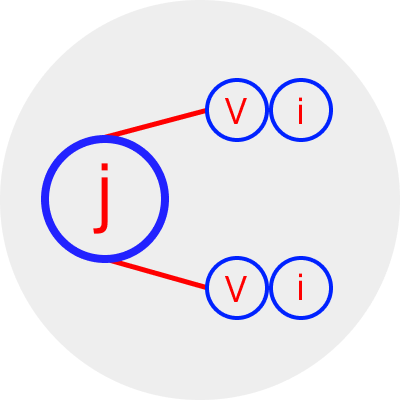

### Greetings!

- 👋 Hi, I’m @j2vi(Vitaly Anischenko)
- 🌍 I'm speak Russian 🇷🇺 and English 🇬🇧
- 👀 I’m interested in Web Development and DevOps
- 🌱 I’m currently learning HTML, CSS, JavaScript, PHP, Python
- 💞️ I’m looking to collaborate on Front-End
- 📫 How to reach me vitaly92a@gmail.com

### My Contacts ans Proftolio

_Social Media_

- Linkedin Page: [linkedin.com/in/vitaly-anischenko-783475195](https://www.linkedin.com/in/vitaly-anischenko-783475195)

_Portfolio_

- CodePen: [codepen.io/j2vi](https://codepen.io/j2vi)

### My own favorite quotes

> 1. Action is the best weapon against depression!
> 2. The pain costs dear. But freedom even more dearest!
> 3. Your dreams must be stronger your fears!

---

<!---
j2vi/j2vi is a ✨ special ✨ repository because its `README.md` (this file) appears on your GitHub profile.
You can click the Preview link to take a look at your changes.
--->
